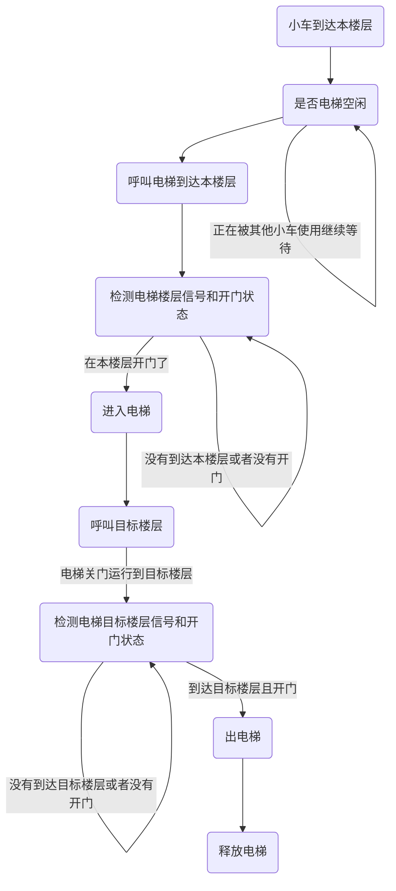

以下改造的设备推荐（三菱 FX5U-32MR/ES）

系统与IO采集模块通信协议是ModbusTcp

## 门

自动门本身是具备门控系统的。AGV改造是将门信号通过PLC块采集到AGV控制系统。

### 改造外加模块(AGV方外加)

控制箱内大概示意图如下：

需要在门控附近，安装如上控制箱。

预留220V电源，网线 （如果使用无线方案，需要满足无线信号要求）。

### 自动门需要提供信号（自动门品牌方）

改造前需要确认门控可提供信号：

输入：开门，关门。

输出：开到位，关到位。

开门状态应该支持保持状态，在没有给开输入信号在的时候，需要一直保持。

### 门改造拓扑图

### 场务

门如果单向通信，门宽需要达到：1.2米。
门如果可以双向通行，门宽需要达到： 2.4米。

## 电梯

电梯本身也是具备控制系统。AGV改造是将门信号通过PLC采集到AGV控制系统。

### 改造外加模块(AGV方外加)

轿顶有220V电源，并具备多孔插排可供取电。

电梯轿顶应提前部署好机器人和系统之间的网络通讯，要求轿顶预留压好水晶头的网线接口。（如果使用无线方案，需要满足无线信号要求）

plc 和电梯必须做到电气隔离，由电梯供应商提供对接接口。

### 电梯需要提供信号（电梯厂商）

以下信号需要电梯控制系统给出，如无法给出需要支持预留改造方案（加装传感器接入到AGV外加模块）。

| PLC -> 电梯    | 电梯 -> PLC    |
| :----------- | :----------- |
| 开门控制         | 开门到位         |
| 关门控制         | 关门到位         |
| 楼层 01- 04 呼叫 | 楼层 01- 04 到达 |
| AGV占用        |              |
AGV占用：AGV占用电梯后人员面板呼叫失效，可以避免人员干扰AGV。
各个楼层增加红色灯，和绿色灯指示，
当AGV占用电梯时，红色灯亮起。电梯外呼按钮同时失效。
当AGV离开释放电梯时，绿色灯亮起，电梯外呼按钮有效。

### 场务

电梯门宽需要满足：大于1.5米
电梯与楼板的缝隙需要满足：小于20厘米
电梯口空间需要满足，可以同时容纳车辆进出：大于2米长 2米宽

### 电梯改造拓扑图

### 交互流程图

